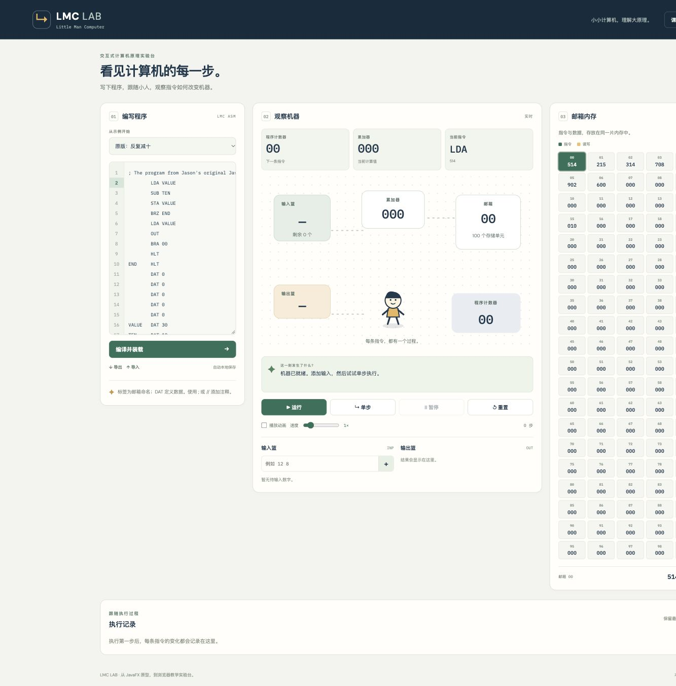

# LMC Lab

An interactive **Little Man Computer** for teaching how instructions, memory and a CPU work together. Built from Jason Han's original JavaFX animation concept, with a new TypeScript simulator and browser interface.

**Teaching preview · v0.1**

[Open the live demo](https://hanyujason.github.io/LMCVisualizer/) · [中文使用说明](使用说明.md) · [Original JavaFX prototype](https://github.com/hanyujason/LMCAnimation)



The original concept and JavaFX prototype were independently developed by Jason. This web version was rebuilt with AI assistance; simulator behavior and classroom workflows are covered by automated tests.

## Run locally

Requires Node.js 24 LTS.

```sh
npm install
npm run dev
```

Open the local URL printed in the terminal, normally http://127.0.0.1:5173/.

```sh
npm test       # simulator and classroom interaction tests
npm run build # type-check and produce the static site in dist/
npm run preview
```

## A first demonstration

1. Choose **Add two numbers**.
2. The initial program is already loaded. After changing it, click **Assemble & load**.
3. Click **+** beside `12 8` to queue both inputs.
4. Click **Step** to execute one instruction, or **Run** to execute continuously.
5. The output is `20`. Reset restores the loaded memory and clears the input/output queues.

**Pause** freezes the current animation. **Resume** finishes it and continues automatic execution. Use the animation checkbox for fast execution, or adjust speed from 0.5× to 4×. Editing and loading are disabled while an instruction is pending; Reset cancels it safely.

The English/Chinese guide and **Classroom view** are in the header. Classroom view hides the editor and enlarges explanations and machine values. The layout also stacks on smaller screens.

## Features

- Two-pass assembler with forward labels, optional label colons, comments (`;`, `//`, `#`), raw machine words, source line errors.
- INP, OUT, LDA, STA, ADD, SUB, BRA, BRZ, BRP, HLT, DAT.
- 100 mailboxes, PC, accumulator, active instruction and operand highlighting.
- Animated fetch/decode/data transfer and human-readable explanations.
- Input queue, persistent output list and last 100 execution records.
- Missing-input waiting, overflow/invalid-instruction errors, and a 1,000-instruction automatic-run guard.
- Five examples: echo, addition, countdown, comparison, and the original repeated-subtraction demo.
- Browser-local source saving, text import/export, bilingual UI, classroom display.
- Bundled fonts; no application requests to external APIs, no login or database.

## Explicit teaching conventions

LMC implementations vary. This first version uses a **signed teaching model**, not a decimal hardware overflow flag:

| Rule | Behavior |
|---|---|
| Addresses | 00–99 |
| Mailbox data and input | Integers −999 to 999 |
| Arithmetic | Signed integers; overflow stops with an error, no wrapping |
| BRZ | Branch if accumulator = 0 |
| BRP | Branch if accumulator ≥ 0, including zero |
| Negative mailbox word | Legal data, invalid as an executed instruction |
| HLT | Machine stops, PC stays at the halt address |
| Missing input | Wait, without consuming a step or advancing PC |
| STA | Can overwrite instructions; unified code/data memory |
| End of memory | A PC outside 00–99 is an error |

These rules should be checked against the professor's course before classroom adoption. The simulator is deliberately isolated so the arithmetic conventions can be adjusted without redesigning the UI.

## Structure

```text
src/core.ts        assembler, immutable machine state, instruction execution
src/core.test.ts   simulator and assembler tests
src/examples.ts    classroom example programs
src/animation.tsx  Little Man SVG, movement stages and instruction explanations
src/App.tsx        interactive controls and teaching animation
src/App.test.tsx   complete classroom workflow regressions
src/style.css     responsive workbench and classroom layout
```

The engine computes a complete next state; the animation presents that transition and commits it once. Pausing keeps the pending transition intact. Reset discards it. Editing the animation does not alter arithmetic rules.

## Deployment

`npm run build` produces a static `dist/` directory. The Pages workflow tests and builds `main`, then deploys to GitHub Pages. Relative asset paths support the repository subdirectory. Pull requests run checks without deploying.

## Current limitations

- Classroom usability still needs feedback from the teacher; the selected LMC convention needs confirmation.
- Memory inspector is read-only; no breakpoints, rewind, cloud collaboration or grading.
- Local saving covers the source and language, not a running machine session. Export programs for portable backups.
- Not a PWA: after building/serving locally it needs no outside services, but an online deployment is not guaranteed to work without a network on its first load.
- First-version diagnostics are in English even when the main UI is Chinese.

The original JavaFX implementation is preserved in [LMCAnimation](https://github.com/hanyujason/LMCAnimation).
